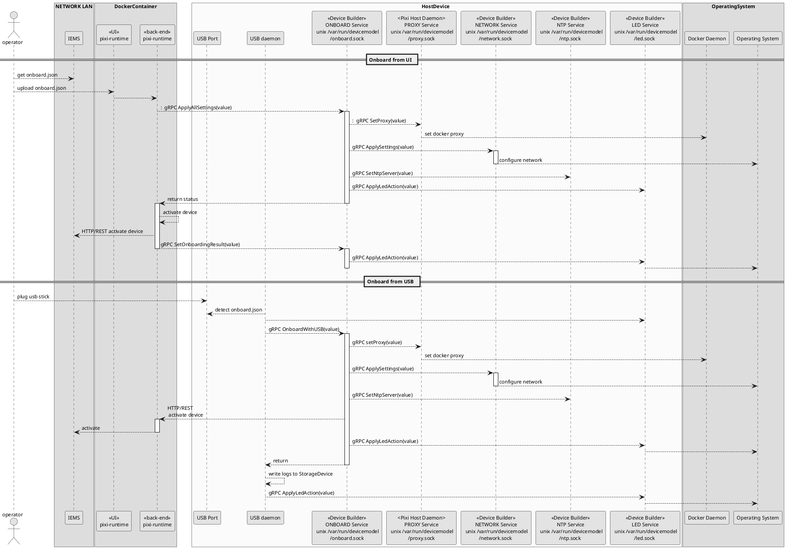

## On Boarding

```plantuml
@startuml
skinparam monochrome true
skinparam DefaultFontSize 11
skinparam DefaultFontName "Segoe UI"


actor operator
box NETWORK LAN 
participant "IEMS" as iems
end box


box DockerContainer
participant "<<UI>>\npixi-runtime" as pixiui
participant "<<back-end>>\npixi-runtime" as pixibackend
end box

box HostDevice  #LightYellow
participant "USB Port" as usb
participant "USB daemon" as usbd
participant "<<Device Builder>>\n ONBOARD Service \n unix /var/run/devicemodel\n/onboard.sock" as obs
participant "<Pixi Host Daemon>\n PROXY Service \n unix /var/run/devicemodel\n/proxy.sock" as pixiproxy
participant "<<Device Builder>>\n NETWORK Service \n unix /var/run/devicemodel\n/network.sock " as nm
participant "<<Device Builder>>\n NTP Service \n unix /var/run/devicemodel\n/ntp.sock " as ntpm
participant "<<Device Builder>>\n LED Service \n unix /var/run/devicemodel\n/led.sock " as ledm
 

end box


box OperatingSystem
participant "Docker Daemon" as dockerd
participant "Operating System" as os
end box


== Onboard from UI  ==
operator --> iems : get onboard.json

operator --> pixiui : upload onboard.json
pixiui --> pixibackend

pixibackend --> obs : :  gRPC ApplyAllSettings(value)


activate obs
obs --> pixiproxy : :  gRPC SetProxy(value)
pixiproxy --> dockerd : set docker proxy
obs --> nm :   gRPC ApplySettings(value)
activate nm

nm --> os : configure network
deactivate nm
obs --> ntpm : gRPC SetNtpServer(value)
obs --> ledm :  gRPC ApplyLedAction(value)

obs --> pixibackend : return status
deactivate obs

activate pixibackend
pixibackend --> pixibackend :  activate device
pixibackend --> iems : HTTP/REST activate device
pixibackend --> obs : gRPC SetOnboardingResult(value)

deactivate pixibackend
activate obs
obs --> ledm :  gRPC ApplyLedAction(value)
ledm --> os
deactivate obs


== Onboard from USB  ==
operator --> usb : plug usb stick
usbd --> usb : detect onboard.json
usbd --> ledm 
usbd --> obs : gRPC OnboardWithUSB(value)


activate obs
obs --> pixiproxy :  gRPC setProxy(value)
pixiproxy --> dockerd : set docker proxy
obs --> nm : gRPC ApplySettings(value)
activate nm

nm --> os : configure network
deactivate nm
obs --> ntpm : gRPC SetNtpServer(value)


obs --> pixibackend : HTTP/REST \n activate device
activate pixibackend

pixibackend --> iems : activate
deactivate pixibackend
obs --> ledm : gRPC ApplyLedAction(value)
ledm --> os 
obs --> usbd : return
deactivate obs
usbd --> usbd : write logs to StorageDevice
usbd --> ledm :  gRPC ApplyLedAction(value)
ledm --> os 

@enduml

```
